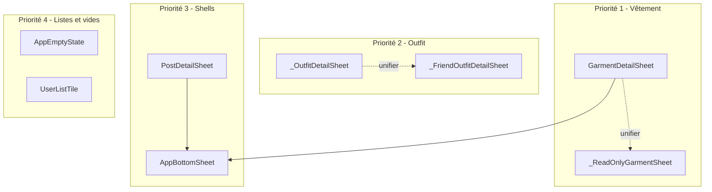

# Audit et uniformisation visuelle uniSaps

## Objectif

Repérer tous les **moments visuellement équivalents** (même intention utilisateur, données similaires) et les faire passer par **un même composant** — en gardant la variante la plus aboutie et **toutes** les capacités (édition, suppression, navigation imbriquée, temps réel, etc.).

Exemple canonique : tap sur un vêtement dans **mon dressing** ([`dressing_screen.dart`](frontend/lib/screens/dressing/dressing_screen.dart)) vs tap sur un vêtement dans le **dressing d’un profil ami** ([`user_profile_screen.dart`](frontend/lib/screens/inspiration/user_profile_screen.dart)) → aujourd’hui deux feuilles différentes.

---

## Déjà bien unifié (ne pas casser)

| Pattern | Widget / util partagé | Écrans |
|---------|----------------------|--------|
| Grille vêtements | [`garment_card.dart`](frontend/lib/widgets/garment_card.dart) | Dressing, créateur, profil ami |
| Filtres dressing | [`dressing_category_chips_row.dart`](frontend/lib/widgets/dressing_category_chips_row.dart), [`dressing_category_filters_bar.dart`](frontend/lib/widgets/dressing_category_filters_bar.dart), [`dressing_garment_filters.dart`](frontend/lib/utils/dressing_garment_filters.dart) | Dressing perso + profil ami |
| Détail post | [`post_detail_sheet.dart`](frontend/lib/widgets/post_detail_sheet.dart) | Inspo, profil, créateur |
| Enrichissement pièces posts | [`post_garment_refs.dart`](frontend/lib/widgets/post_garment_refs.dart) | Feed, cartes, détail |
| Erreurs réseau | [`async_error_state.dart`](frontend/lib/widgets/async_error_state.dart) | Plusieurs onglets |

---

## Cartographie des doublons (par priorité)

### P1 — Détail vêtement (écart principal signalé par toi)

| | Propriétaire / créateur | Profil ami (lecture) |
|--|-------------------------|----------------------|
| **Fichier** | [`garment_detail_sheet.dart`](frontend/lib/widgets/garment_detail_sheet.dart) | [`user_profile_screen.dart`](frontend/lib/screens/inspiration/user_profile_screen.dart) L1499 `_ReadOnlyGarmentSheet` |
| **Entrées** | `DressingScreen`, `CreatorDressingScreen`, outfit ami via `_FriendOutfitDetailSheet` | `_DressingTab`, tap pièce dans outfit ami |
| **Carousel** | 280px, `GarmentPhotoCarousel` | 260px, même widget |
| **timesWorn** | Badge vert | Texte caption |
| **Titre** | `heading2` 24px | `heading3` |
| **Couleurs** | `GarmentColorsWrap` 14px | `fontSize: 12` |
| **Scroll** | `Column` fixe | `maxHeight 88%` + scroll |
| **Actions** | Modifier + Supprimer | Aucune |
| **Temps réel** | `garmentStream` | Snapshot passé en paramètre |

**Référence retenue :** `GarmentDetailSheet` (plus complète visuellement + stream).

**Cible :** étendre `GarmentDetailSheet` avec un mode `GarmentDetailMode { owner, readOnly }` :
- `readOnly` : masquer boutons Modifier/Supprimer ; garder badge `timesWorn`, carousel **280**, `heading2`, scroll si contenu long (reprendre `Flexible` + `SingleChildScrollView` du read-only).
- `owner` : comportement actuel inchangé.
- Remplacer tous les appels à `_ReadOnlyGarmentSheet` par `GarmentDetailSheet.show(context, garment, mode: readOnly)`.
- Supprimer `_ReadOnlyGarmentSheet` du fichier profil (ou le laisser comme alias déprécié une PR).

**Confirmation suppression vêtement :** aujourd’hui bottom sheet custom dans [`dressing_screen.dart`](frontend/lib/screens/dressing/dressing_screen.dart) L266 vs `AlertDialog` côté créateur — extraire [`widgets/confirm_delete_dialog.dart`](frontend/lib/widgets/confirm_delete_dialog.dart) et utiliser partout.

---

### P2 — Détail outfit

| | Mes outfits | Profil ami |
|--|-------------|------------|
| **Widget** | `_OutfitDetailSheet` dans [`outfits_screen.dart`](frontend/lib/screens/outfits/outfits_screen.dart) | `_FriendOutfitDetailSheet` dans [`user_profile_screen.dart`](frontend/lib/screens/inspiration/user_profile_screen.dart) |
| **Container** | max 85 %, statique | `DraggableScrollableSheet` |
| **Photos** | 1 image ratio 3/4 | Hero + bandeau multi-photos + plein écran |
| **Pièces** | Liste statique, label slot | Liste cliquable → détail vêtement |
| **Actions** | `onChoose` / `onDelete` optionnels | Lecture seule |

**Référence retenue :** fusionner sur une base **`OutfitDetailSheet`** dans [`widgets/outfit_detail_sheet.dart`](frontend/lib/widgets/outfit_detail_sheet.dart) :
- Shell : `DraggableScrollableSheet` + handle (comme profil ami).
- Contenu photo : carousel / plein écran du modèle ami.
- Liste pièces : lignes cliquables vers `GarmentDetailSheet` (mode readOnly) quand `garmentCache` fourni.
- Slots propriétaire : conserver labels `categoryLabel` pour mes outfits.
- Actions optionnelles en bas : `onChooseToday`, `onDelete` (uniquement mode owner).

Migrer `_OutfitDetailSheet` et `_FriendOutfitDetailSheet` vers ce widget ; [`outfit_card.dart`](frontend/lib/widgets/outfit_card.dart) (non utilisé aujourd’hui) : soit brancher `_OutfitsTab` dessus, soit supprimer le dead code après migration.

---

### P3 — Shell des bottom sheets

Incohérences de chrome (handle, `transparent`, `AppRadii`, hauteur max) entre :
- [`post_detail_sheet.dart`](frontend/lib/widgets/post_detail_sheet.dart) (meilleur)
- [`garment_detail_sheet.dart`](frontend/lib/widgets/garment_detail_sheet.dart)
- feuilles inline profil (`_MemoryDetailSheet`, `_ProfileFriendsSheet`, ancien read-only)

**Cible :** [`widgets/app_bottom_sheet.dart`](frontend/lib/widgets/app_bottom_sheet.dart) :
- `AppBottomSheet.show(context, child: …, {maxHeightFraction: 0.92})`
- Handle 40×4, fond `AppColors.surface`, coins `AppRadii.sheet`
- Refactor progressif : `PostDetailSheet`, `GarmentDetailSheet`, `OutfitDetailSheet`, liste amis

---

### P4 — États vides

~12 implémentations inline (icônes 44–72, textes seuls) vs [`empty_feed_message.dart`](frontend/lib/widgets/inspiration/empty_feed_message.dart).

**Cible :** renommer/généraliser en [`widgets/app_empty_state.dart`](frontend/lib/widgets/app_empty_state.dart) :
- Variante `standard` (icône 72, titre, sous-titre, CTA optionnel) — base `EmptyFeedMessage`
- Variante `compact` (icône 48) pour onglets secondaires
- Remplacer : dressing vide, posts/outfits/amis vides profil, créateur posts, recherche, onglet amis profil perso

Conserver [`outfits_screen.dart`](frontend/lib/screens/outfits/outfits_screen.dart) `_EmptyState` seulement si le CTA « Créer » reste spécifique ; sinon migrer vers `AppEmptyState` + `action`.

---

### P5 — Lignes utilisateur (amis / recherche)

Row avatar + @username recodée dans :
- [`profile_screen.dart`](frontend/lib/screens/profile/profile_screen.dart) `_FriendsTab`
- [`user_profile_screen.dart`](frontend/lib/screens/inspiration/user_profile_screen.dart) `_ProfileFriendsSheet`
- [`search_users_screen.dart`](frontend/lib/screens/inspiration/search_users_screen.dart) `_UserResultTile`

**Cible :** [`widgets/user_list_tile.dart`](frontend/lib/widgets/user_list_tile.dart) (trailing : menu, chevron, bouton ajouter, badge demande).

---

### P6 — Cartes post (secondaire, plus risqué)

| Implémentation | Fichier | Note |
|----------------|---------|------|
| Feed éditorial | `_InspoPostCard` | Animations double-tap, menu — **garder** comme couche feed |
| Grille générique | `PostCard` | Profil, preview |
| Admin créateur | `_PostTile` | Stats vues/likes |

**Action prudente :** migrer [`creator_posts_screen.dart`](frontend/lib/screens/creator/creator_posts_screen.dart) `_PostTile` → `PostCard(layout: grid)` + overlay stats si besoin ; **ne pas** fusionner `_InspoPostCard` dans un premier lot (régression UX feed).

**Preview créateur :** optionnel — afficher variante feed ou ouvrir `PostDetailSheet` depuis « Aperçu feed » pour coller au détail réel.

---

### P7 — Profils (hors scope immédiat sauf stats)

Trois écrans légitimement différents (moi / tiers / marque créateur). Unification limitée :
- Extraire [`widgets/stat_row.dart`](frontend/lib/widgets/stat_row.dart) depuis [`profile_screen.dart`](frontend/lib/screens/profile/profile_screen.dart) `_ProfileHeroStatCell` et [`creator_profile_screen.dart`](frontend/lib/screens/creator/creator_profile_screen.dart) `_StatCell` (déjà quasi identiques).

Ne pas fusionner `ProfileScreen` et `UserProfileScreen` (navigation et onglets trop différents).

---

## Matrice de décision « quelle UI garder »

| Cas d’usage | UI de référence | Pourquoi |
|-------------|-----------------|----------|
| Tap vêtement (tout contexte lecture) | `GarmentDetailSheet` readOnly | Carousel, typo, badge porté |
| Tap vêtement (propriétaire) | `GarmentDetailSheet` owner | Stream + actions |
| Tap outfit détail | `OutfitDetailSheet` (nouveau, base ami) | Photos riches + pièces cliquables |
| Tap post détail | `PostDetailSheet` | Déjà unifié |
| Grille dressing | `GarmentCard` + chips partagés | Déjà unifié |
| Sheet modal | `AppBottomSheet` | Tokens + handle cohérents |
| Liste vide | `AppEmptyState` | Titre + sous-titre + CTA |
| Ligne ami | `UserListTile` | DRY listes sociales |

---

## Plan d’implémentation (ordre recommandé)

### Lot 1 — Vêtement (impact direct sur ta demande)
1. Refactor [`garment_detail_sheet.dart`](frontend/lib/widgets/garment_detail_sheet.dart) : modes `owner` / `readOnly`, API `GarmentDetailSheet.show`.
2. Remplacer `_ReadOnlyGarmentSheet` et appels dans `user_profile_screen.dart` (dressing tab + outfit ami).
3. Aligner hauteurs/typos/couleurs sur la variante owner.
4. Extraire dialog confirmation suppression ; aligner dressing + créateur.

### Lot 2 — Outfit
1. Créer `widgets/outfit_detail_sheet.dart` (fusion ami + mes outfits).
2. Migrer `outfits_screen.dart` et `user_profile_screen.dart`.
3. Brancher ou retirer `OutfitCard` mort.

### Lot 3 — Fondations UI
1. `AppBottomSheet` + migration feuilles principales.
2. `AppEmptyState` + migration ~8 écrans.
3. `UserListTile` + migration listes amis.

### Lot 4 — Optionnel
1. `StatRow` partagé profil / créateur.
2. `PostCard` grille créateur ; preview post → `PostDetailSheet`.

---

## Vérification (sans perte de fonctionnalité)

Checklist par lot :

- **Dressing perso** : ouvrir vêtement → modifier → supprimer → image temps réel après edit.
- **Dressing créateur** : idem + route édition catalogue créateur.
- **Profil ami** : dressing filtré, tap vêtement, tap outfit → tap pièce → retour ; pas de boutons edit/delete.
- **Mes outfits** : biblio / swipe / daily → détail → choisir aujourd’hui / supprimer selon contexte.
- **États vides** : messages + CTA inchangés sémantiquement.
- **320px** : pas d’overflow sur feuilles unifiées.
- `flutter analyze` sans nouvelle erreur bloquante.

---

## Fichiers touchés (estimation)

| Lot | Fichiers principaux |
|-----|---------------------|
| 1 | `garment_detail_sheet.dart`, `user_profile_screen.dart`, `dressing_screen.dart`, `creator_dressing_screen.dart`, `confirm_delete_dialog.dart` (nouveau) |
| 2 | `outfit_detail_sheet.dart` (nouveau), `outfits_screen.dart`, `user_profile_screen.dart` |
| 3 | `app_bottom_sheet.dart`, `app_empty_state.dart`, `user_list_tile.dart` + ~10 écrans consommateurs |
| 4 | `creator_posts_screen.dart`, `post_card.dart`, `creator_profile_screen.dart`, `profile_screen.dart` |

**Hors scope :** refonte navigation profil, fusion `_InspoPostCard` / feed (lot 4 optionnel uniquement).
